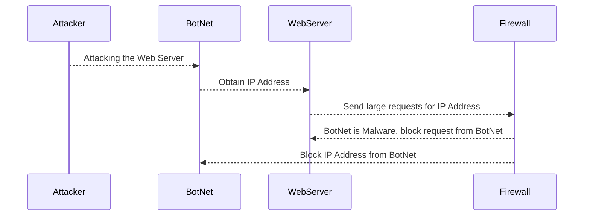

#Descriptions
1. Attacker tells the BotNets to attack the WebServer.
2. BotNets send large requests to obtain the IP address from WebServer.
3. WebServer alerts Firewall of BotNet security breach attempt and of malicious requests.
4. Firewall blocks request for IP address from BotNet.
5. Firewall blocks IP address from BotNet.

#Contributions
- Attacker: Manually sends BotNet commands to attack the WebServer.
- BotNet: Overloads the WebServer by sending large amount of IP address rquests in attempt to shut down the WebServer.
- WebServer: The websites data storage knows it is being attacked and alerts firewall of potential incoming threats.
- Firewall: Protects the computer WebServer from outside IP address requests and protects data by blocking the external requests.
- Packet Filtering: Response from the Firewall to filter through threats that are incoming to the server and manages the requests.
